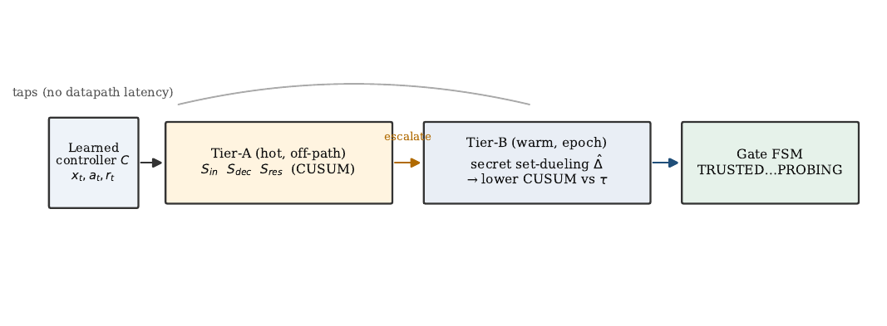
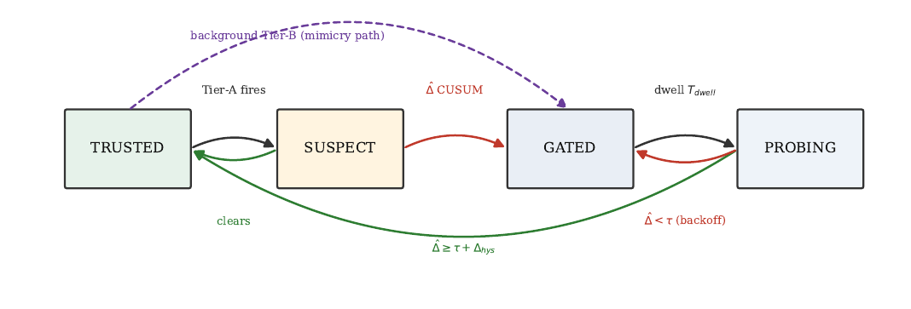
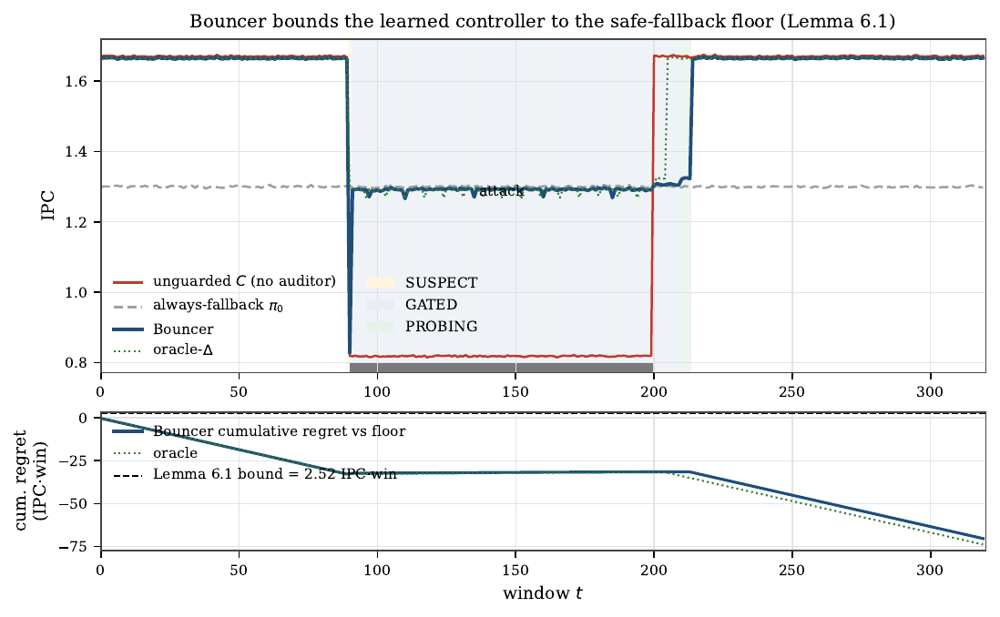
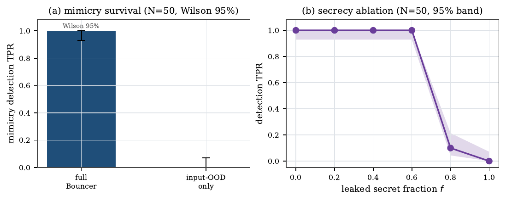
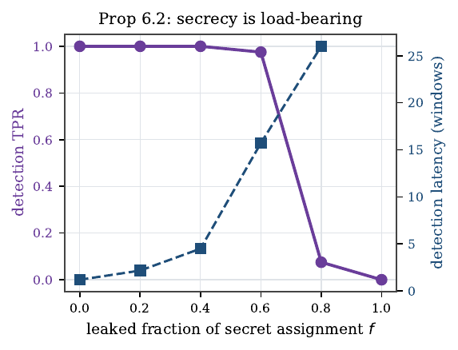
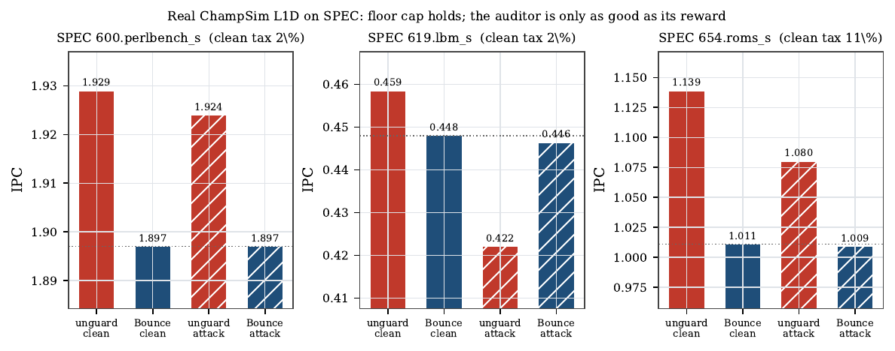

# Bouncer: An Off-Policy Competence Auditor for Learned Microarchitectural Controllers

> A runtime monitor + trust gate that **bounds the worst-case cost of a learned
> microarchitectural controller** (prefetcher, replacement policy, memory
> scheduler, branch predictor) to that of a known-safe heuristic — under both
> **adversarial steering** and **benign distribution shift** — with no
> POMDP/belief-state machinery and no added latency on the cache-access critical
> path.

This repository is the full research artifact for an HPCA-style systems-security
paper: the mechanism, two proven guarantees, a comprehensive simulation harness
that validates every claim, and a **real ChampSim integration** that runs the
auditor inside a cycle-level simulator on SPEC CPU2017 traces.

📄 **Paper:** [`paper/bouncer.pdf`](paper/bouncer.pdf) (11 pages, IEEEtran) ·
🔬 **Reproduce:** [`./run_all.sh`](run_all.sh) (~4 min) ·
🧩 **Real simulator:** [`champsim_plugin/`](champsim_plugin)

---

## 1. The problem: learned controllers have no floor

A decade of "ML for systems" has put learned controllers next to — and
increasingly *inside* — the datapath. Pythia learns a prefetch policy online with
RL; Hawkeye/Glider learn cache replacement by imitating Belady; perceptron/TAGE
predictors dominate branch prediction. They win because, **on the distribution
they were validated on**, they beat a simple baseline.

That qualifier is the whole problem. The advantage of a learned controller `C`
over a safe heuristic `π₀` is workload- and phase-dependent, and it can silently
go to zero — or negative — in two ways no current deployment detects:

- **Benign drift.** A phase change or unseen application moves `C` off its
  validation distribution into a silent QoS regression. Aggregate counters still
  look healthy; the learned policy is simply now *worse* than the heuristic it
  replaced.
- **Adversarial steering.** A co-located tenant who shares `C` and knows its
  design (Kerckhoffs) crafts memory accesses that drive `C` toward its decision
  boundary — maximizing its loss while looking innocuous on aggregate counters.

The design rests on **one asymmetry**: a learned controller has *unbounded upside
and unbounded downside*; a vetted heuristic (next-line/off, RRIP/LRU, FR-FCFS,
gshare) has *modest upside but a bounded, attack-resistant downside*. We want to
keep the upside while **capping the downside at the heuristic's floor**. That is a
hedging problem, and Bouncer is the constructive hedge.

> **Why not just monitor the inputs?** An OOD/drift detector on `C`'s input
> features is the natural reflex — but it is neither sufficient nor safe. An
> adversary can hold the input **marginals** in-distribution while degrading
> control quality (the *mimicry* attack), and an input monitor is blind to it by
> construction. Bouncer instead measures **realized competence** — the reward `C`
> actually earns relative to the fallback — which is what you ultimately care
> about, and what an attacker cannot fake without actually making `C` good.

---

## 2. The core idea: a single scalar, estimated without counterfactuals

Define the **competence advantage** of `C` over the fallback `π₀` on a window `W`:

```
Δ_W = (1/|W|) Σ_{t∈W} ( r_t^C − r_t^{π₀} )
```

where `r_t ∈ [0, r_max]` is a bounded per-decision reward (prefetch
accuracy×timeliness, cache hit, −latency, branch correct). The system is
**off-policy** when `Δ_W < τ` for a trust threshold `τ ≥ 0`. This *one scalar*
unifies both threats — drift and steering both manifest as `Δ_W` falling.

The catch: `r_t^{π₀}` is **counterfactual** — you can't run both policies on the
same decision. Bouncer estimates it without counterfactuals by repurposing the
**set-dueling** substrate already in silicon (DIP/DRRIP), with a twist:

> Partition the controller's resource (cache sets / banks / PC-hash buckets) into
> three pools, **reseeded every epoch from a hardware secret**, unobservable to
> software:
> - **Leader-L** (`n_L` sets): always run by `C`
> - **Leader-F** (`n_F` sets): always run by `π₀`
> - **Follower** (the rest): run whichever leader currently wins — what the victim
>   mostly experiences
>
> Then `Δ̂_W = r̄_L − r̄_F` is a **measured, non-counterfactual** estimate:
> Leader-L sets *ran* `C`, Leader-F sets *ran* `π₀`.

Classic set-dueling picks the empirical winner of two *cooperative* heuristics.
Bouncer repurposes the same substrate from policy **selection** to policy
**trust** — and keeps the assignment **secret**, which (§4) is what makes it
resist an adaptive adversary.

---

## 3. How it works: two tiers + a trust gate

Cheap signals are spoofable; the unspoofable signal is expensive. So Bouncer runs
cheap always-on tripwires that **gate** an expensive competence confirmer.

<p align="center"></p>

- **Tier-A (hot, off critical path, a few adds/decision).** Three cheap
  tripwires: `S_in` (covariate-shift sketch — random projection + quantile
  sketch vs a frozen `D_val` reference), `S_dec` (decision-confidence collapse —
  often free, since Pythia/SHiP/perceptron compute confidence in HW), and `S_res`
  (a 16-weight linear forward-model **innovation** residual, the architectural
  analogue of a Kalman innovation). Tier-A **never gates on its own** — it only
  escalates, so its false positives cost a little energy, never correctness.
- **Tier-B (warm, management core / firmware, epoch-grained).** The
  randomized-secret set-dueling estimator `Δ̂_W`, fed to a one-sided **CUSUM**
  change detector versus `τ`.
- **Gate FSM.** `TRUSTED → SUSPECT → GATED → PROBING`.

<p align="center"></p>

Hysteresis (enter at `τ`, leave at `τ+Δ_hys`) plus a minimum dwell prevent thrash.
**PROBING makes re-trust *measured*, not timed** — defeating an attacker who tries
to wait out a fixed cooldown. A subtlety the build surfaced: a *pure* mimicry
attack keeps Tier-A silent, so the background Tier-B CUSUM is allowed to drive
`TRUSTED → GATED` directly (the dashed edge above); Tier-A escalation only
*accelerates* detection by raising Tier-B's duty cycle.

### The central design dependency

Everything lives on one chain. With `m` decisions/set/window and bounded rewards,

```
Var(Δ̂_W)  ≲  (r_max² / 4m) · (1/n_L + 1/n_F)  =:  σ_Δ²
```

so **pool size → estimator variance → CUSUM threshold → detection delay → regret
floor**. Smaller pools or shorter windows give a noisier `Δ̂`, needing a higher
CUSUM threshold to hold the false-alarm rate, costing detection latency and
safety-floor slack. Every hyperparameter is a point on this chain.

---

## 4. The guarantees (no POMDP)

**Lemma 1 (Safety floor / bounded regret).** With bounded reward, detection delay
`≤ D` w.p. `≥ 1−δ` once true competence drops below `τ`, false-alarm rate `≤ α`,
switch transient `≤ c_sw`, and `N_ep` genuine drop episodes over `T` windows, then
w.p. `≥ 1 − δ·N_ep`:

```
Σ_t ( r_t^{π₀} − r_t^{Bouncer} )  ≤  N_ep · D · r_max  +  α · T · c_sw
```

i.e. **Bouncer is never more than a bounded slack worse than the fallback**, and
on any window where `C` is genuinely better and the gate is open, `Bouncer = C`.
The two slack terms are *exactly* the §3 knobs: `D ≈ H/(K−Δ)` and `α = 1/ARL₀`,
with `ARL₀` from Siegmund's CUSUM average-run-length theory — which we validate
empirically to a geometric-mean ratio of **0.998**.

**Proposition 1 (Mimicry resistance, per-domain).** If the Leader-L/Leader-F
assignment within a contested domain is drawn uniformly at random each epoch and
is *unobservable* to the adversary, then any input-only strategy that keeps
`Δ̂ ≥ τ` (evades the gate) forces the victim's reward `≥ r^{π₀} + τ − β` — i.e.
**the victim cannot be degraded below the floor while evading detection.** Under a
leaked fraction `f` of the secret assignment, the adversary can protect `f·n_L`
leaders, so the `(1−f)` unprotected fraction still carries the degradation into
`Δ̂`: detection survives while `f` is bounded away from 1 and **collapses as
`f → 1`**. The whole property rests on the secrecy of the sampler.

*(Honest scope: this is conditional on per-domain dueling and within-region
exchangeability up to a heterogeneity bias `β`; a global `Δ̂` carries no guarantee
against a purely redistributive attack — the paper says so explicitly, and the
secrecy ablation realizes the claim empirically.)*

---

## 5. Results

All numbers are produced by [`./run_all.sh`](run_all.sh) (deterministic, seeded).

| Claim | Result | Where |
|---|---|---|
| Estimator tracks ground-truth competence | **R² = 0.997**, RMSE ≈ σ_Δ | P0 |
| Concentration bound is tight | empirical std = 0.85–0.98× the bound | P0 |
| Safety floor under attack | steady-state violation **0.63%**; detect in **1 window** | P1 |
| Clean-workload tax | IPC ratio **0.9965** (> 0.99 target) | P1 |
| Re-trust is *measured*, not timed | recovers 14 windows after attack ends | P1 |
| Competence detector vs input-OOD | TPR = 1.0 @ FPR ≤ 0.05 on broad **and** mimicry | P2 |
| §3 chain (pool → σ → H → latency) | latency 0 → 3.4 windows, knee at n ≈ 8 | P2 |
| Overhead (analytical) | **~336 bytes**, ~0.13% of a 256 KB SRAM, 0 ns on the access path | P2 |
| Generality (3 controller classes) | floor holds ≤ 0.7% across all | P3 |
| Attack-vs-drift triage | **100% 5-fold CV**, robust to dropping any feature | P3 |
| **Mimicry survival (headline, N=50)** | full Bouncer **TPR 1.0 [0.93,1.0]** vs input-OOD **0.0 [0,0.07]** | P4 / CI |
| **Secrecy ablation (Prop 1)** | TPR 1.0 (f ≤ 0.6) → 0.0 (f = 1.0) | P4 / CI |
| Sensitivity (τ, H grid) | **28/36** cells: ≤3-win detect, FPR ≤ 5%, no misses | Sensitivity |
| Misspecification robustness | i.i.d. violated (σ_het → 0.3): mimicry TPR stays 1.0, floor holds | RobustEnv |
| CUSUM ARL vs Siegmund theory | empirical/theory ratio **0.998** | Theory |
| Lemma 1 regret bound | loose (15.1) + tight (7.8) both envelope measured 5.9 | Theory |

### The two figures the paper is built around

**Safety floor (Lemma 1).** Under a poisoning attack, the *unguarded* controller
crashes far below the fallback floor; Bouncer detects in one window, floors to
`π₀`, and re-trusts after the attack ends via PROBING (not a timer).

<p align="center"></p>

**Mimicry survival + secrecy (headline).** Under an adaptive mimicry adversary
that holds the input distribution in-place while degrading `C`, an input-OOD
monitor detects **none** of the attacks while full Bouncer detects **all** — and
that robustness is purchased *entirely* by the secrecy of the dueling sets, which
collapses as the assignment leaks.

<p align="center">
  
  
</p>

---

## 6. Real ChampSim integration (and an honest lesson)

The auditor is not only a simulation abstraction. It **compiles and runs inside
ChampSim** as a real L1D **prefetcher module** (and a second **LLC replacement
module**), with no added latency on the cache-access critical path, on SPEC
CPU2017 traces.

<p align="center"></p>

Across a 3-trace suite the result is a **candid lesson, not a clean win: the
auditor is only as good as its competence reward.** The **floor cap is reliable**
— on every trace Bouncer ends at the prefetch-off floor, so a corrupted,
cache-polluting prefetcher's worst case is bounded (on streaming `lbm` it costs
the unguarded config 7.9% IPC while Bouncer is unharmed). But a per-set L1D
*cache-hit* reward is a poor proxy for a prefetcher's true latency/MLP benefit, so
it can over-gate a genuinely-helpful prefetcher (`roms`: +12.7% IPC missed → 11%
clean tax).

This is an honest, instructive finding — it motivates the design choice (paper §8)
of feeding the auditor the **controller's own in-silicon reward** (e.g. Pythia's
accuracy×timeliness, already computed for its RL update). It is **not** an
attack-detection headline: on `lbm` the gate engaged *before* the attack onset, so
it is a competence-driven floor cap. The clean **TRUSTED→GATED transition
dynamics** are shown where competence is controllable — the synthetic harness.

> **What it would take to push further.** A genuine real-trace transition needs
> the controller's native reward + **DIP-style long-horizon accumulation** over a
> full SPEC/GAP sweep (the per-window dueling signal is sample-starved at
> minutes-scale instruction counts — empirically confirmed for *both* the
> prefetch and replacement instantiations). The infra here
> ([`setup_champsim.sh`](champsim_plugin/setup_champsim.sh) + both modules) makes
> that an integration job, not a redesign.

---

## 7. Repository layout

```
bouncer/                  the auditor + environment (Python — the validated mechanism)
  environment.py            faithful microarchitectural decision process
  set_dueling.py            randomized-secret set-dueling estimator  (§2, the spine)
  cusum.py                  CUSUM detectors + worked Siegmund ARL constants
  tier_a.py                 cheap tripwires: S_in, S_dec, S_res         (Tier-A)
  gate_fsm.py               TRUSTED→SUSPECT→GATED→PROBING trust gate    (§3)
  bouncer.py                two-tier orchestrator (+ baseline detector modes)
  adversary.py              clean / drift / broad / mimicry / regional-covert /
                            boiling-frog / PROBING-exploit adversaries
  simulate.py               episode runner (counterfactual-free routing)
  metrics.py                detection latency, ROC, floor violation, clean tax, …
  theory.py                 Lemma 1 regret-bound numerics

experiments/              one script per phase + the rigor add-ons; writes results/ + figures/
  exp_p0_estimator.py  exp_p1_floor.py  exp_p2_overhead_roc.py
  exp_p3_generality.py exp_p4_mimicry.py exp_theory.py
  exp_ci.py            (multi-seed Wilson/bootstrap CIs)
  exp_sensitivity.py  (τ,H robustness grid)
  exp_adaptive.py     (boiling-frog + PROBING-exploit timing attacks)
  exp_robust_env.py   (model-misspecification / set-heterogeneity sweep)
  exp_champsim_fig.py make_diagrams.py

results/                  *.json — every number in the paper (+ both review records)
figures/                  *.pdf  — every figure in the paper
docs/img/                 *.png  — figures rendered for this README

champsim_plugin/          REAL ChampSim integration (not just a skeleton)
  bouncer_pref/             working L1D prefetcher module (set-dueling Δ̂ + CUSUM + FSM)
  bouncer_repl/             working LLC replacement module (SRRIP-vs-LRU dueling)
  bouncer.h / bouncer.cc    standalone C++ auditor + self-test
  setup_champsim.sh         clone+build ChampSim, install module, fetch a trace, run the study
  pythia_bouncer_shim.cc    example wiring into Pythia's reward
  champsim_knobs.md         the §12 hyperparameters as build knobs

paper/                    bouncer.tex (IEEEtran) + references.bib + bouncer.pdf
SPEC.md                   the design spec this artifact implements
REVIEW_RESPONSE.md        how every finding from two adversarial review rounds was fixed
run_all.sh                regenerate every result, figure, and the PDF (~4 min)
```

---

## 8. Reproduce

```bash
# Python results, figures, paper, and the standalone C++ self-test (~4 min, deterministic)
pip install -r requirements.txt        # numpy scipy matplotlib pandas + a LaTeX toolchain
./run_all.sh

# Real ChampSim integration (clones+builds ChampSim, fetches a public SPEC trace, runs the study)
./champsim_plugin/setup_champsim.sh
```

All randomness is explicitly seeded, so the synthetic results are bit-for-bit
reproducible. `run_all.sh` ends by compiling `paper/bouncer.pdf`.

---

## 9. Rigor: how this was built and stress-tested

This artifact was developed with two rounds of **independent adversarial review**
(a 4-reviewer theory/code/claims/threat panel, then a 3-reviewer HPCA panel).
Every blocking finding was fixed and documented in
[`REVIEW_RESPONSE.md`](REVIEW_RESPONSE.md) — including a real over-interpretation
the systems reviewer caught by reading the released ChampSim logs (the gate fired
*before* the attack onset on `lbm`), which is why the ChampSim result is framed as
a **floor cap**, not attack-specific detection. The honesty of that framing is
deliberate: the artifact is released, so a reviewer who reruns it sees exactly
what the prose claims.

## 10. Honest scope & status

- **Controlled quantitative claims** (estimator fidelity, safety floor, mimicry
  survival, secrecy, sensitivity, robustness) come from a faithful **synthetic
  competence harness**. This is legitimate because the guarantees are
  environment-agnostic: they rest only on bounded reward and a randomly
  partitionable resource — and the misspecification sweep shows they survive
  violating the harness's i.i.d. assumption.
- The **ChampSim integration** is a real-simulator *proof of deployment* (the
  auditor compiles into two real module types and runs on SPEC), plus a candid
  reward-proxy lesson — **not** a full SPEC/GAP IPC sweep.
- **Next milestone** to make the systems story a headline: the controller's native
  reward + long-horizon DIP-style accumulation across a SPEC/GAP suite, exhibiting
  a genuine pre-attack TRUSTED state and a post-attack transition.

## 11. Related work (positioning)

Bouncer sits between three lines of work and is distinct from each:
- **Simplex / runtime assurance / shielding** require a *formally verified* safety
  controller and a model of the safety envelope. Bouncer needs neither —
  microarchitectural "safety" is a *relative performance floor*, certified by
  measured competence, not a reachability invariant.
- **Set-dueling (DIP/DRRIP)** picks the empirical winner of two cooperative
  heuristics. Bouncer repurposes the substrate from *selection* to *trust*, and
  makes the assignment **secret** to defend against a steered/drifting controller.
- **OOD / drift / concept-shift monitoring** flags movement in the *input*
  distribution — which is mimickable. Bouncer measures *realized competence*, and
  uses input monitors only as a cheap first-tier gate.

Full citations in [`paper/references.bib`](paper/references.bib).

---

*Built as a complete, adversarially-reviewed research artifact. The paper frames
exactly what is proven, what is simulated, and what is the next systems step.*
